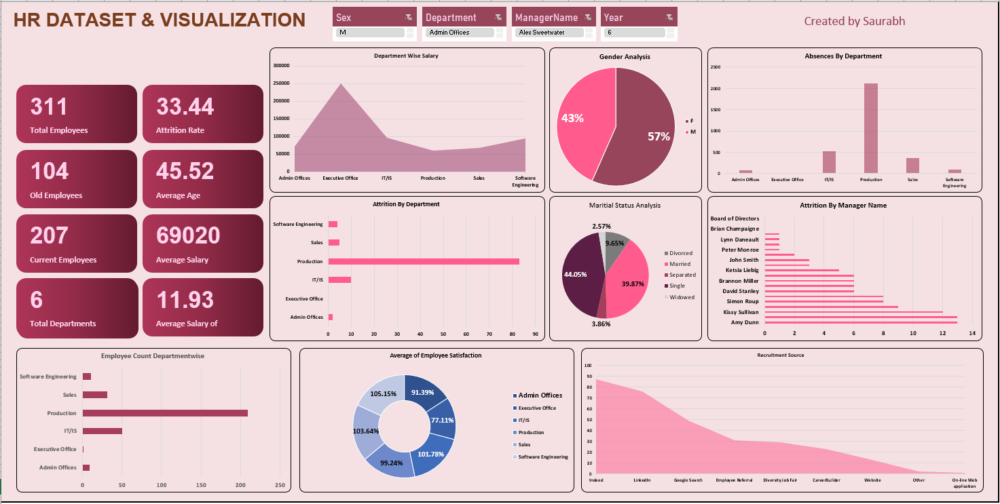

# HR Dataset & Visualization Dashboard

This project presents a detailed **HR analytics dashboard** built using **Microsoft Excel**, offering insights into employee demographics, attrition, satisfaction, departmental distribution, and salary analysis.

## 📌 Features

- Total Employees, Attrition Rate, Average Age & Salary
- Department-wise Salary & Absenteeism
- Gender & Marital Status Analysis
- Employee Satisfaction by Department
- Attrition Trends by Department and Manager
- Recruitment Sources Breakdown

## 📸 Dashboard Preview

## 📂 Files

- `HR Dataset.xlsx`: Raw dataset used for analysis
- `Dashboard.png`: Screenshot of the final dashboard

## ✍️ Created by

**Saurabh**
## 💼 LinkedIn
http://linkedin.com/in/saurabh-shahare
